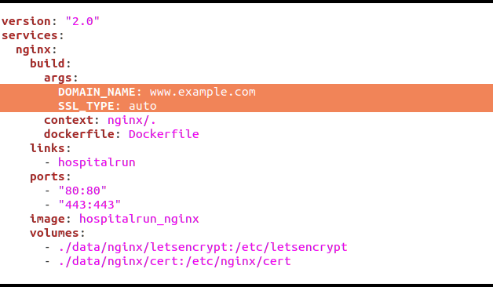

**HospitalRun Deployment Guide**
==============================


Welcome to HospitalRun Deployment Documentation. You can log issues, comments or contributions on the public repository [here](https://github.com/HospitalRun/hospitalrun-server).

# **Overview**

## **1. Pre-requisites**

* [Docker](https://www.docker.com/)
* [NodeJS](https://nodejs.org/en/)
* [CouchDB](http://couchdb.apache.org/)
* [ElasticSearch](https://www.elastic.co/products/elasticsearch)
* [Logstash](https://www.elastic.co/products/logstash)
* [Bash](https://www.gnu.org/software/bash/)
* [Nginx](https://www.nginx.com/resources/wiki/)

## **2. Important Configuration Scripts**

Here are some configuration scripts that have been used in designing this application. It is important you know exactly what they do, so you can manipulate your configuration or scale them as you desire.

* docker-compose.yml

* config-example.js

* Dockerfile

* utils/elasticsearch.sh

* nginx/conf/certbot-auto

* nginx/conf/*.tmpl, nginx/conf/*.conf

* nginx/conf/entrypoint.sh

* nginx/Dockerfile

* logstash/pipeline/logstash.conf

* logstash/Dockerfile

* data

* conf/initcouch.sh

* conf/entrypoint.sh

# **Deploying HospitalRun to a Production Environment**

**Assumptions:** You should have `git`, `docker` and `docker-compose` running on your machine before the steps above can work. The instructions also assume you will be running this on a Linux machine, preferably Ubuntu LTS >=14.04

## **Step-by-Step Guide**

Follow these five easy steps to get HospitalRun up and running

1. Clone the repository  `git clone git@github.com:HospitalRun/hospitalrun-server.git`.

2. Run `cd hospitalrun-server`. This should take you into the `hospitalrun-server` root folder

3. From this location, edit the `docker-compose.yml` file.

  *If you wish to use automatic SSL cert generation, edit the `DOMAIN_NAME` argument and replace `www.example.com` as shown in the image below with the publicly accessible domain name that HospitalRun will run on.

  *If instead you wish to use your own SSL cert, change the `ENCRYPTION_TYPE` argument to `self` and copy your SSL cert files to nginx/conf/cert/ as `ssl.crt` and `ssl.key`. You can create the `cert` folder if it doesn't exist.

4. Save the file and run `docker-compose up --build -d`. You should wait for some ten minutes or less for your environment to be up and running. Deployment speed will vary based on your internet connection speed and the quality of your infrastructure

5. Go to [http://localhost:8055/](http://localhost:8055/) in a browser and login with username ```hradmin``` and password ```test```



# **The Data Folder**

This folder contains all the data needed to be available should the containers be shutdown, or restarted for any reason. It should contain after startup, the following:

1. Nginx folder, and Let's Encrypt certificates

2. CouchDB Data

3. Elasticsearch Data

If you delete this folder, you WILL lose all your data and installed SSL certificate

# **Docker Containers on HospitalRun Server**

**List of Containers:**

1. Nginx - WebServer

2. HospitalRun - Node.JS App Server

3. Logstash - Log Streaming Application

4. Elasticsearch - For Search

5. CouchDB - NoSQL Data Store

**Nginx**

The Nginx container contains configuration files for routing requests to the app server. It definitely can handle more requests in a production environment and is suited for such. This container is also designed to automatically install letsencrypt certificates for secure HTTP. It receives requests from the internet and routes it to port 3000 on the hospitalrun container. It listens for requests on ports 80 and 443

* * *


**HospitalRun**

This container runs the application and listens for requests on port 3000. At startup, it has entry point scripts that initialize couchdb using the conf/initcouch.sh script and another that at utils/elasticsearch.sh that initializes elasticsearch mappings. The container also runs the npm start command on successful deployment

* * *


**Logstash**

This container gets relevant data from the couchdb container using the instruction in logstash/conf/logstash.conf file and passes over relevant data to the elasticsearch container

* * *


**Elasticsearch**

This container receives data passed to it from logstash, making it possible to have lightening fast search results from the HospitalRun application

* * *


**CouchDB**

This container saves user authentication and all other data within the HospitalRun application.
